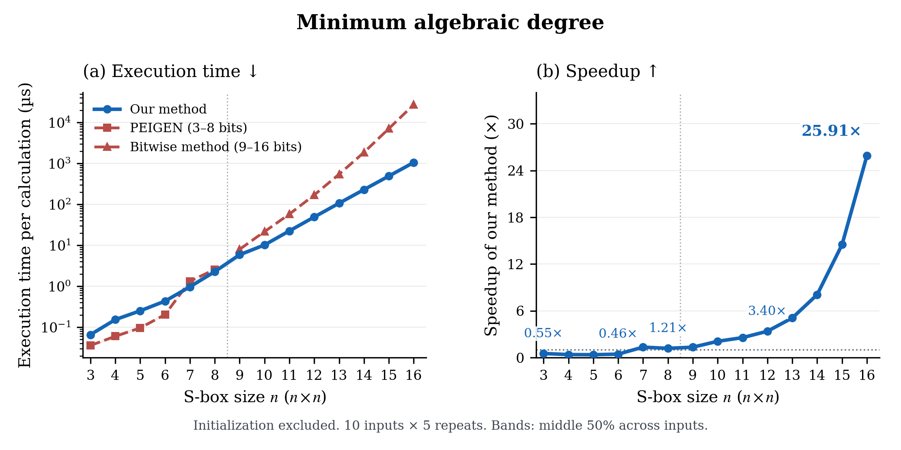
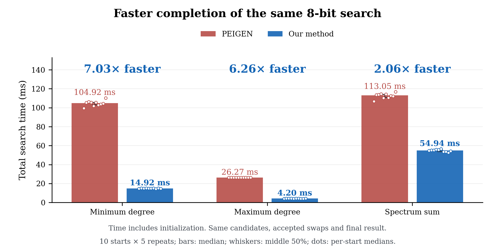

# Fast S-box algebraic degree computation

Code and experimental data for **A Series of Faster Approaches for Computing the Algebraic Degree Properties of S-boxes**, by Renjie Zhou, Zhen Li and Yan Tong.

The implementations compute the minimum algebraic degree and update the maximum algebraic degree or the complete component-degree spectrum after an output transposition. The artifact includes reproducible single-thread experiments and complete 8-bit local searches.

## Start here

On Linux x86-64 with GCC 13 or later, GNU Make and Python 3.10 or later:

```sh
git clone https://github.com/MarstonRaines/fast-sbox-degree.git
cd fast-sbox-degree
make -j4 all
make check
python3 scripts/analyze.py --check
```

The build downloads 21 unchanged PEIGEN headers from a fixed upstream commit and checks every file against a saved SHA-256 digest. `make check` runs independent small-input checks, update/rollback checks, exhaustive 2-by-2 mappings and component-enumeration checks. `make check-full` additionally checks every stored component-ANF coefficient in 12 states of two 16-bit inputs.

The 16-bit spectrum state needs substantial memory: about 512 MiB with packed coefficients, versus about 16 GiB for the scalar reference representation, before auxiliary buffers. Full reference timing sweeps take hours. Reading the existing results and recomputing their tables needs no C++ build.

## Contents

| Directory | Contents |
|---|---|
| `src/serial/` | Scalar reference algorithms, packed proposed algorithms and the PEIGEN adapter |
| `data/inputs/` | 147 explicit LUTs and fixed swap/check sequences |
| `data/measurements/` | 12,100 timing records and 1,460 separate operation-count records |
| `data/outputs/` | Deduplicated complete final LUTs, degree histograms and accepted swaps |
| `protocol/` | Exact ordered tasks, repetitions and frozen workload sizes |
| `results/serial/` | Reference, optimized, practical-instance and search tables |
| `scripts/` | Dependency download, workload replay, table reconstruction and plotting |
| `figures/` | Four publication figures and one numerical table in PDF, SVG and 300 dpi PNG |
| `docs/` | Protocol, results, measured-build provenance and release validation |

See [the experimental protocol](docs/protocol.md) for the distinction between single-evaluation, fixed-update and full-search workloads, and [the results guide](docs/results.md) for the interpretation of speedups.

## Reproduce measurements

Start with a small subset:

```sh
python3 scripts/run.py --suite serial --group B --case random_n08_00 --metric spectrum --limit 2 --output runs/smoke
```

Use `--list` to inspect selected tasks; omit filters to replay the full serial suite. Optional `--cpu-start` and `--numa-node` use `numactl` for binding. Every run uses a new output directory and checks its full final output against the saved expected output.

Regenerate the published result tables:

```sh
python3 scripts/analyze.py
```

These tables are derived from the archived measurements in `data/measurements/`. New timings are written only to the chosen `runs/` directory and do not replace the archived measurements.

## Figures

```sh
python3 -m pip install -r requirements.txt
python3 scripts/plot_results.py
```

The [figure guide](docs/figures.md) contains the current previews, source-table links, statistical definitions and complete captions. Each metric has a time/speedup pair with direct numerical labels. All plots read the saved result tables directly.





## Version and license

Release **v1.0.2** focuses the publication artifact on the experiments used by the manuscript: optimized single-thread comparisons over 3--16 bits, practical instances, complete searches, and the retained scalar-reference audit tables. The supplementary parallel extension and scalar-reference promotional figure from v1.0.1 are not part of this release; v1.0.1 remains available in Git history for provenance.

This is a publication packaging revision: the retained numerical kernels match the measured source versions, while validation and reporting have been repackaged. [Provenance](docs/provenance.json) records the measured source and binary digests; [release validation](docs/release-validation.json) records checks of the packaged build. The archived timings were not regenerated using the packaged build.

The project is licensed under **GPL-3.0-only**; see [LICENSE](LICENSE). PEIGEN is an external dependency with its own retained [GPL-3.0 license](third_party/PEIGEN-LICENSE), authorship and header notices. Its exact revision is recorded in [third_party/peigen.json](third_party/peigen.json). Please also cite Bao, Guo, Ling and Sasaki's [PEIGEN paper](https://eprint.iacr.org/2019/209) when using that baseline.
