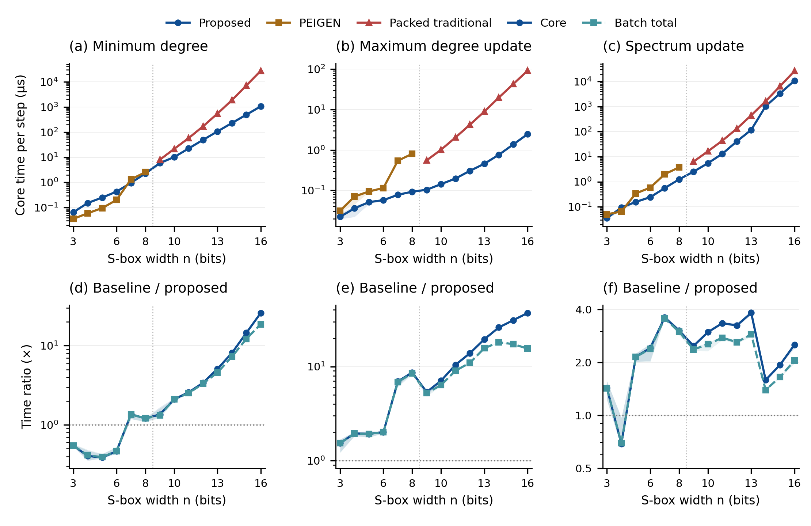
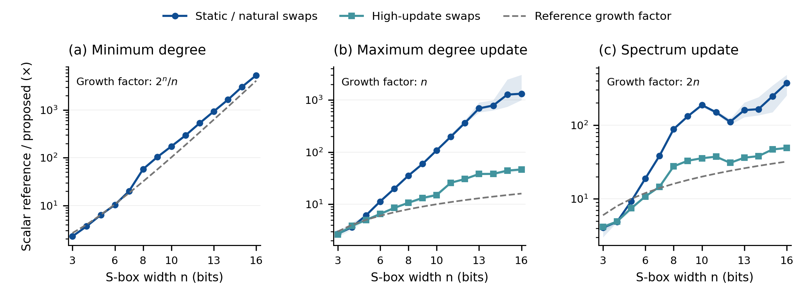
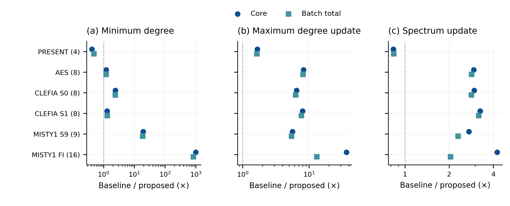
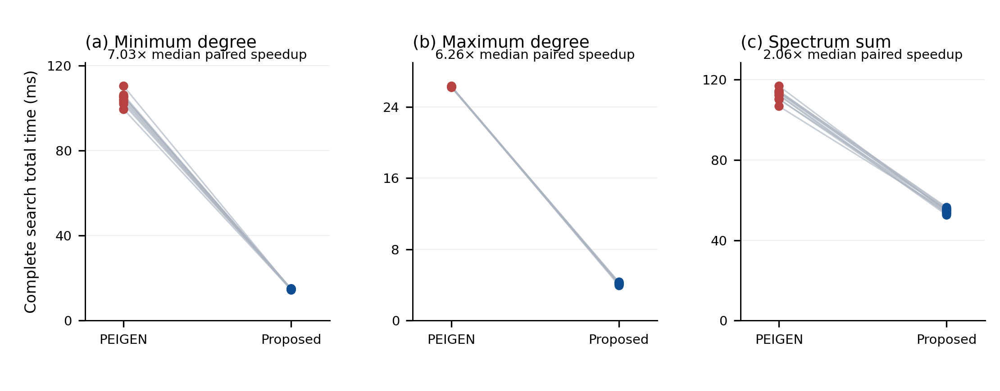
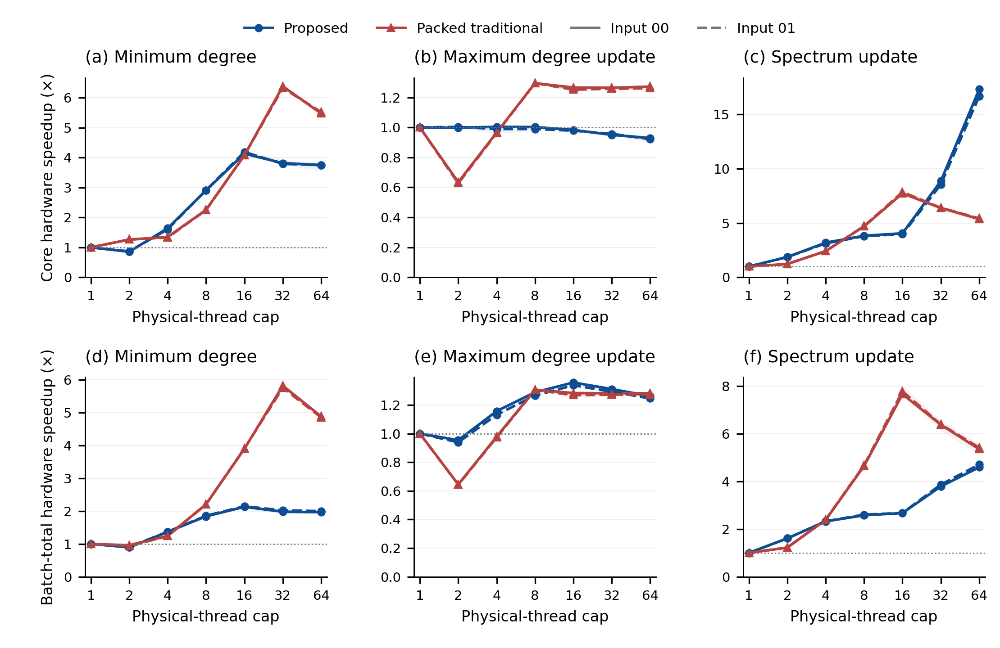
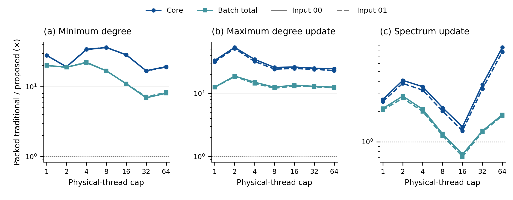

# Figure guide and captions

All figures are generated from audited CSV tables by `scripts/plot_results.py`. Each has a PDF with embedded text, an SVG with editable text, and a 300 dpi PNG. No data are copied into the plotting script. The six compositions use coordinated small multiples and, for full search, paired connecting lines. Proposed-method curves are blue throughout. Figures are 7.4 inches wide; they are intended for a full-width paper layout.

Time/ratio axes in Figures 1, 2, 3 and 6 are logarithmic; search time in Figure 4 and hardware speedup in Figure 5 are linear. Thread-cap axes use base-2 logarithmic spacing. All axes retain actual numeric values. Export checks confirmed six single-page vector PDFs, embedded fonts, live SVG text, and no text outside the page. All compositions were visually inspected; crowded ratio ticks were simplified without changing data.

Rebuild with:

```sh
python3 -m pip install -r requirements.txt
python3 scripts/analyze.py --check
python3 scripts/plot_results.py
```

Use `--only search`, for example, to regenerate a single composition. `figures/manifest.json` records the source-table and export SHA-256 digests and plotting-library versions.

## 1. Optimized single-thread scaling



**Caption.** Optimized single-thread computation on random n-by-n permutations for n = 3–16. Columns show minimum-degree evaluation, maximum-degree update and complete degree-spectrum update. Top panels report core time per evaluation or committed transposition; bottom panels report baseline/proposed ratios for core time and batch-total time including context and state initialization. PEIGEN is used at n = 3–8 and the packed traditional implementation at n = 9–16; the vertical dotted line marks that change. Each input has five timing repetitions. Curves show medians across ten independently generated inputs after taking each input's median time and forming its paired ratio. Shading is the interquartile range across inputs. Horizontal ratio = 1 denotes equal time. Batch sizes are frozen and metric-dependent, as specified in the protocol.

Source: `results/serial/optimized/scaling-results.csv`.

## 2. Scalar reference scaling



**Caption.** Core-time ratios between the specified scalar reference and the proposed algorithms implemented using the same scalar representation. Minimum degree is evaluated statically; the two update metrics use natural and high-update transposition profiles. Curves and shading are medians and interquartile ranges across ten inputs, each summarized over five repetitions. Dashed gray curves are the reference growth factors 2^n/n, n and 2n; they are complexity-related factors, not fitted runtime predictions. Operation counts are reported separately in `mechanism-per-input.csv`; at n = 16 the high-update spectrum workload has a logical ANF XOR ratio of 32.0078125. These comparisons are separate from the optimized PEIGEN/packed results.

Source: `results/serial/reference-scaling.csv`.

## 3. Practical instances



**Caption.** Optimized baseline/proposed time ratios for six practical inputs; bit widths are in parentheses. Dots show core-time ratios and squares show batch-total ratios, each obtained from the two methods' median times over five repetitions. The baseline is PEIGEN for widths up to 8 and the packed traditional implementation for widths 9 and 16. FI uses fixed subkey 0. Minimum evaluation uses the original input; update measurements follow fixed transpositions starting from that input and therefore include its modified variants. A ratio below 1 favors the baseline. Initial standard-instance degree histograms are tabulated separately.

Source: `results/serial/optimized/practical-results.csv`.

## 4. Complete 8-bit local search



**Caption.** Total time to complete a deterministic first-improvement local search from ten random 8-bit starting permutations. Each line connects PEIGEN and the proposed evaluator for the same input and objective; each endpoint is the median of five repetitions. Total time includes context and evaluator initialization. Both methods examine the same candidate sequence, accept the same transpositions and return the same final LUT and complete histogram. Annotations give the median paired time ratio across the ten inputs. Minimum degree, maximum degree and spectrum sum are optimized in separate searches. Searches with zero accepted moves still perform the complete neighborhood scan. The practical and identity-control searches are retained in the full result table.

Source: `results/serial/optimized/search-results.csv`.

## 5. Parallel scaling



**Caption.** Hardware speedup on two fixed random 16-bit inputs for the proposed and packed traditional implementations. Top panels use core time and bottom panels use batch-total time, including initialization. Speedup is the same implementation's one-thread time divided by its time at the specified physical-thread cap, paired by repeat index; lines show the median of five paired ratios and shading their interquartile range. Solid and dashed lines distinguish inputs 00 and 01. Both implementations use the same physical cores and NUMA node. Workloads contain one static minimum evaluation, 512 maximum updates or 128 spectrum updates. Small kernels may stay serial and coordinate work has at most 16 rows; the thread setting is a cap. This is a two-input scaling study on one socket, distinct from the ten-input single-thread study.

Source: `results/parallel/hardware-scaling.csv`.

## 6. Equal-thread algorithm comparison



**Caption.** Packed traditional/proposed time ratios at equal physical-thread caps for the two fixed random 16-bit inputs. Core and batch-total ratios are distinguished by marker and color; solid and dashed lines distinguish inputs 00 and 01. Each point is the median of five repeat-index-paired ratios. A ratio above 1 favors the proposed implementation. This comparison evaluates the two algorithms with equal thread resources; it differs from the within-implementation hardware speedup in Figure 5. The complete table also contains 8-bit, 12-bit, practical-instance and search cases.

Source: `results/parallel/algorithm-comparison.csv`.
