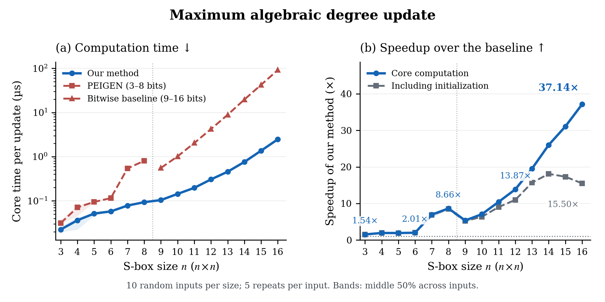
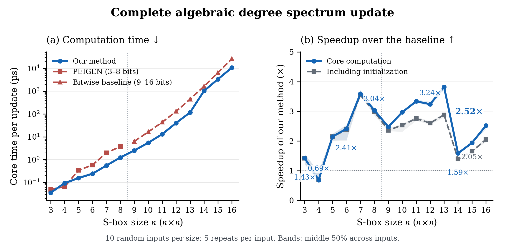
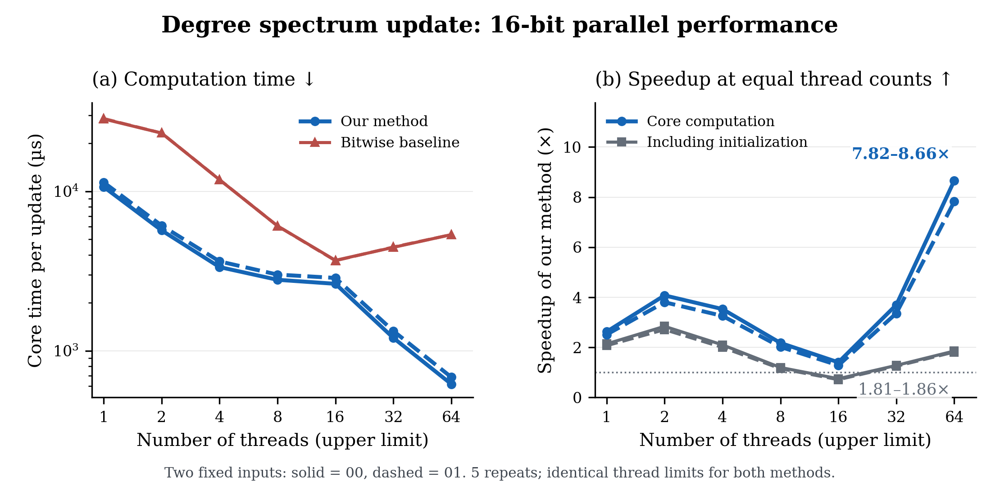
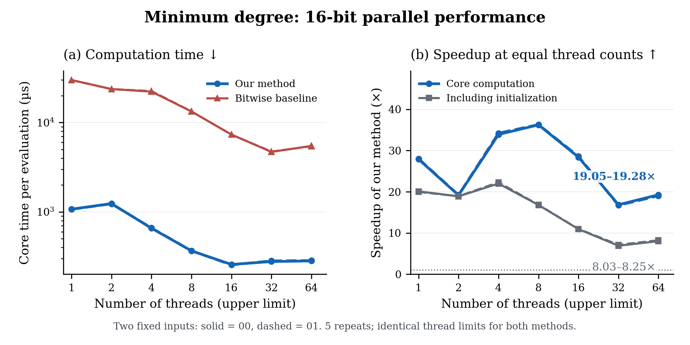
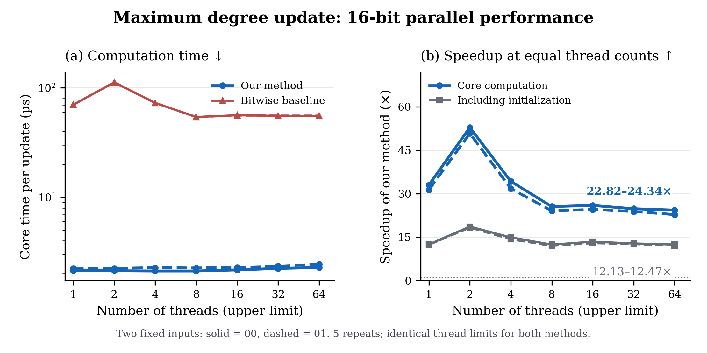
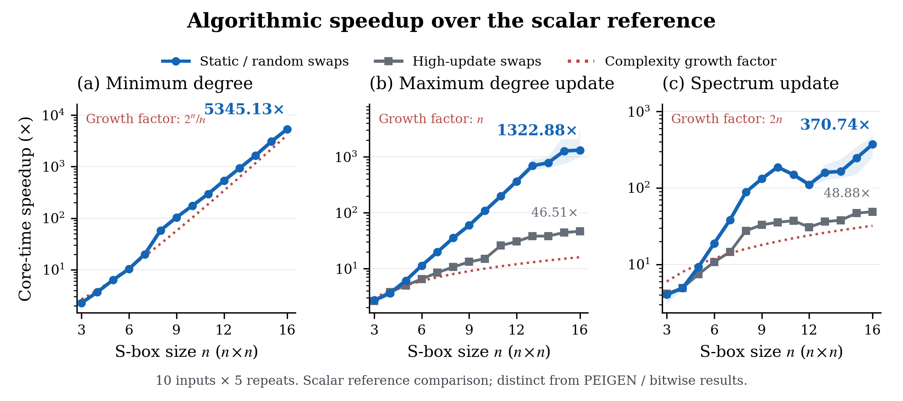
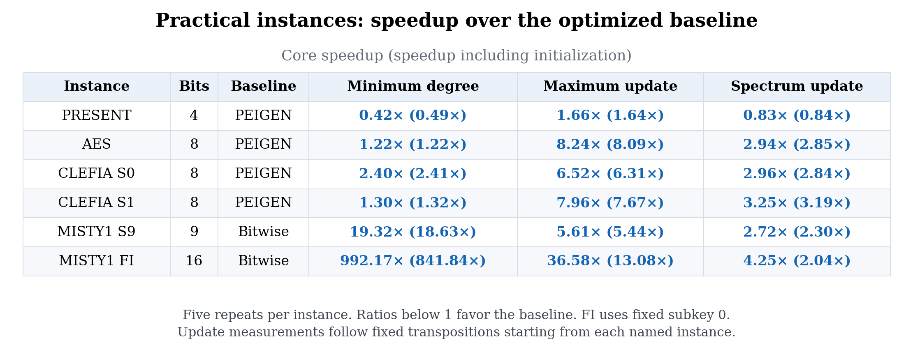

# Figure guide and captions

The current set contains **eight figures and one numerical table**. Each ordinary metric now has its own time/speedup pair, matching the paper's original reading order. Blue identifies the proposed method or its core speedup; red identifies the optimized baseline; gray identifies the speedup including initialization. Direct annotations give measured ratios. The earlier six composite figures have been replaced.

All values come from the unchanged audited CSV tables. All 3–16-bit points, both fixed parallel inputs, every measured thread cap and ratios below 1 are retained. An annotation is a rounded value at a selected point, not an additional measurement. Bars and speedup panels use zero-based linear axes; computation-time panels and the scalar-reference comparison use logarithmic axes. No axis breaks or fitted curves are used.

**Timing.** Core time excludes context and state initialization. "Including initialization" is the ratio of complete fixed-batch times: context + state initialization + timed computation. It is not a single cold-call latency. Speedup in Figures 1–7 is baseline time divided by proposed-method time, at equal thread resources where applicable. Within-method one-thread/multithread speedups are reported separately below.

**Statistics.** For the ordinary random-input results, each input first contributes its median over five repetitions. Curves show medians across ten inputs; speedups are computed within each input before summarizing. Bands show the middle 50% (IQR) across those inputs. For parallel results, absolute times are five-repeat medians, with repeat IQR bands. Ratios are medians of repeat-index-paired ratios. Solid/dashed curves retain the two individual inputs; endpoint ranges span those two estimates and are not confidence intervals.

Every figure/table has an embedded-font PDF, editable-text SVG and 300 dpi PNG, 7.4 inches wide. Data and export hashes are in [the manifest](../figures/manifest.json).

Rebuild with:

~~~sh
python3 scripts/analyze.py --check
python3 scripts/plot_results.py
~~~

Use --only 03_degree_spectrum_update to regenerate one plot, or --output build/figure-review to inspect a candidate before replacing published exports.

## 1–3. Optimized single-thread computation

**Figure 1.** Minimum algebraic degree computation on random n-by-n permutations, n = 3–16. Left: core time per evaluation, lower is better. Right: speedup over the optimized baseline, higher is better; gray includes initialization of the full timed batch. PEIGEN is used at 3–8 bits and the packed bitwise traditional implementation at 9–16 bits; the vertical dotted line marks this baseline switch. Ten inputs per size, five repeats per input; median and IQR as defined above. At 16 bits, median core and batch-total speedups are 25.91× and 18.64×.

**Figure 2.** Maximum algebraic degree updates after committed output transpositions, with the same baseline selection and statistics as Figure 1. Left: core time per update. Right: core and initialization-inclusive batch speedups. The 16-bit batch contains 512 updates; its core and batch-total ratios are 37.14× and 15.50×.

**Figure 3.** Complete algebraic degree-spectrum updates after committed output transpositions, with the same baseline selection and statistics as Figure 1. Each update maintains the complete component-degree histogram. The 16-bit batch contains 128 updates; its core and batch-total ratios are 2.52× and 2.05×. The full scale-dependent variation, including the 4-bit result below 1 and the 14-bit decrease, is retained.

Source for Figures 1–3: [scaling-results.csv](../results/serial/optimized/scaling-results.csv). Frozen metric-dependent batch sizes are described in [the protocol](protocol.md).

## 4. Complete 8-bit search

**Figure 4.** Total time, including initialization, to complete deterministic first-improvement local searches from ten random 8-bit starting permutations. Minimum degree, maximum degree and spectrum sum are optimized in separate searches. Bar heights are medians across per-input five-repeat medians; whiskers show their IQR and dots show all ten per-input medians. Direct time labels give the bar heights. The annotations 7.03×, 6.26× and 2.06× are medians of paired per-input speedups, not ratios recomputed from the displayed bar heights. Both implementations examine the same candidates, accept the same transpositions and return the same final LUT and histogram. Zero-acceptance runs still complete the entire neighborhood scan. Practical and identity-control starts remain in the full table.

Source: [search-results.csv](../results/serial/optimized/search-results.csv).

## 5–7. Parallel computation at equal thread resources

**Figure 5.** Complete degree-spectrum updates on two fixed random 16-bit inputs. Left: core time per update for each implementation. Right: bitwise-baseline/proposed time ratios at each equal physical-thread cap, with both core and initialization-inclusive batch ratios. Solid/dashed lines distinguish inputs 00/01. Each batch contains 128 updates. At 64 threads, the two core ratios are 7.82–8.66× and total ratios are 1.81–1.86×. The below-1 total ratios at 16 threads remain visible. The proposed implementation's within-method speedups at 64 threads are 16.69–17.32× for core time and 4.59–4.71× for batch-total time.

**Figure 6.** Minimum-degree computation on the same two random 16-bit inputs and thread caps. Left: absolute core time per evaluation. Right: core and full-batch algorithm speedups at equal thread caps. Each timed batch contains one static evaluation after initialization. Core time falls until approximately 16 threads; additional threads do not improve it further. Within-method core speedups at 16 threads are 4.13× and 4.18×, with total speedups 2.13× and 2.15×.

**Figure 7.** Maximum-degree updates on the same two random 16-bit inputs, 512 updates per batch. Left: absolute core time per update. Right: equal-thread algorithm speedups for core and total batch time. The proposed core remains faster than the bitwise baseline at every tested cap, while its own core time receives essentially no multithreaded improvement. These two statements use different denominators; the complete within-method values are tabulated below.

Sources: [absolute times](../results/parallel/timings-and-scaling.csv), [equal-thread ratios](../results/parallel/algorithm-comparison.csv), and [within-method scaling](../results/parallel/hardware-scaling.csv). Both implementations use the same physical cores and NUMA node. Thread counts are upper limits; small kernels may stay serial and coordinate work has at most 16 independent rows.

## 8. Scalar-reference comparison

**Figure 8.** Core-time speedup over the specified scalar reference, with both implementations using the same scalar representation. Minimum degree is evaluated statically; update metrics use the saved random transpositions and a high-update profile affecting at least half of the ANF index set. Curves and bands are medians and IQRs across ten inputs, each summarized over five repeats. Dotted reference factors 2^n/n, n and 2n describe complexity growth; they are not exact runtime predictions. Endpoint labels identify the measured 16-bit ratios for each profile. These measurements use a different reference from Figures 1–7. The logical operation counts, including the 16-bit high-update spectrum XOR ratio 32.0078125, are reported separately.

Sources: [reference-scaling.csv](../results/serial/reference-scaling.csv) and [mechanism-per-input.csv](../results/serial/mechanism-per-input.csv).

## Table 1. Practical instances

**Table 1.** Optimized-baseline/proposed speedups on six practical inputs. Each cell gives core speedup followed by initialization-inclusive batch speedup in parentheses. Each method contributes its median over five repeats. Baselines are PEIGEN up to 8 bits and the packed bitwise traditional implementation at 9 and 16 bits. FI is evaluated at fixed subkey 0. Minimum-degree evaluation uses the original input; update measurements follow fixed transpositions starting from it. Ratios below 1 favor the baseline. The approximately 992× minimum-degree ratio on the structured FI instance is specific to that instance; random 16-bit inputs have the separate 25.91× median in Figure 1.

Source: [practical-results.csv](../results/serial/optimized/practical-results.csv).

## Within-method parallel scaling

The tables below retain the hardware-scaling comparison previously plotted separately. Each entry is the range of the two fixed inputs' median paired ratios, T(1)/T(p); it is **not** the baseline/proposed ratio used in Figures 5–7. Core and total mean the same timing intervals as above. All seven caps and both methods are included; IQRs and individual input values remain in the source CSV.

### Minimum degree

| Threads | Proposed core | Proposed total | Bitwise core | Bitwise total |
|---:|---:|---:|---:|---:|
| 1 | 1.00× | 1.00× | 1.00× | 1.00× |
| 2 | 0.86–0.87× | 0.89–0.91× | 1.26× | 0.94–0.96× |
| 4 | 1.60–1.64× | 1.37× | 1.33–1.35× | 1.24–1.25× |
| 8 | 2.90–2.91× | 1.84–1.86× | 2.25× | 2.21× |
| 16 | 4.13–4.18× | 2.13–2.15× | 4.08× | 3.90–3.91× |
| 32 | 3.79–3.81× | 1.98–2.02× | 6.33–6.38× | 5.76–5.83× |
| 64 | 3.75× | 1.97–2.00× | 5.47–5.52× | 4.86–4.89× |

### Maximum degree update

| Threads | Proposed core | Proposed total | Bitwise core | Bitwise total |
|---:|---:|---:|---:|---:|
| 1 | 1.00× | 1.00× | 1.00× | 1.00× |
| 2 | 1.00× | 0.94–0.95× | 0.63–0.64× | 0.64× |
| 4 | 0.99–1.00× | 1.13–1.16× | 0.96–0.97× | 0.97–0.98× |
| 8 | 0.99–1.00× | 1.27–1.29× | 1.30× | 1.31× |
| 16 | 0.98× | 1.34–1.36× | 1.25–1.27× | 1.27–1.28× |
| 32 | 0.95–0.96× | 1.29–1.31× | 1.26× | 1.27–1.28× |
| 64 | 0.92–0.93× | 1.25–1.26× | 1.26–1.27× | 1.27–1.28× |

### Degree spectrum update

| Threads | Proposed core | Proposed total | Bitwise core | Bitwise total |
|---:|---:|---:|---:|---:|
| 1 | 1.00× | 1.00× | 1.00× | 1.00× |
| 2 | 1.87× | 1.61× | 1.23× | 1.22–1.23× |
| 4 | 3.13–3.19× | 2.32× | 2.41–2.42× | 2.39–2.40× |
| 8 | 3.79–3.83× | 2.58–2.60× | 4.69–4.72× | 4.64–4.67× |
| 16 | 3.98–4.05× | 2.67–2.68× | 7.73–7.85× | 7.66–7.78× |
| 32 | 8.56–8.87× | 3.79–3.87× | 6.39–6.40× | 6.38–6.39× |
| 64 | 16.69–17.32× | 4.59–4.71× | 5.36–5.43× | 5.35–5.41× |
